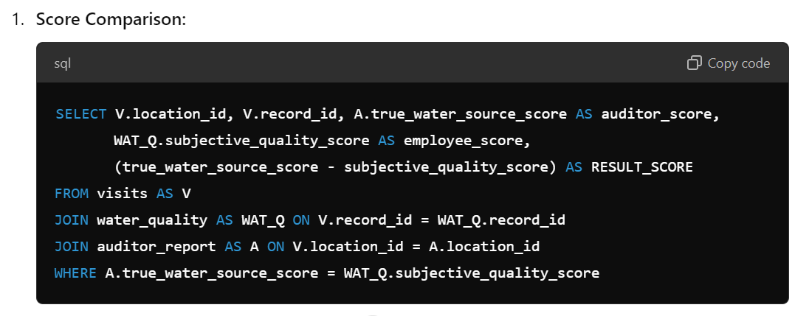
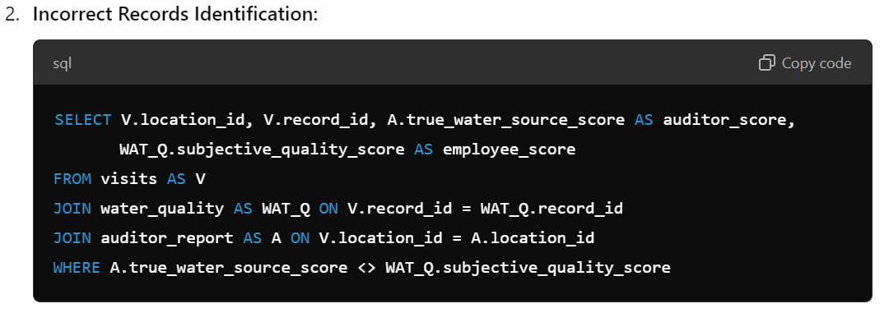
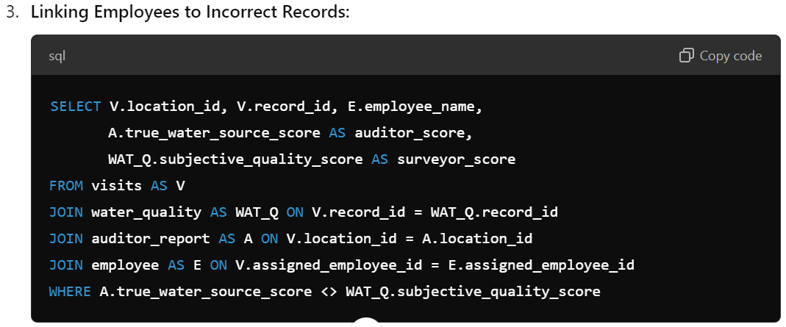
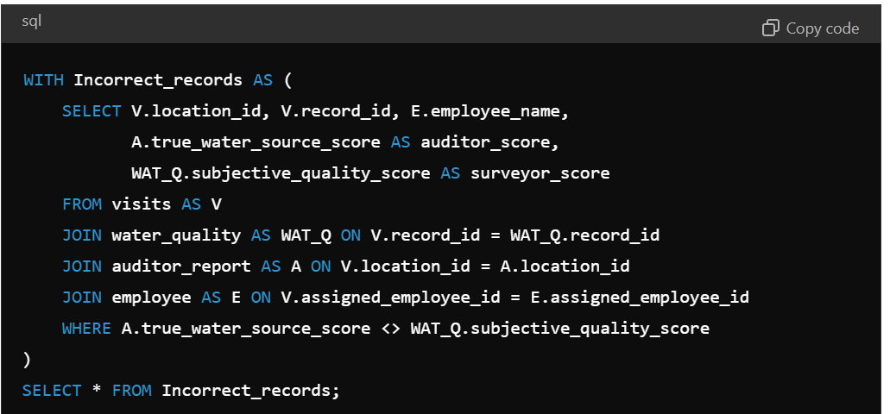

# SQL DATA QUERYING: PART THREE
## Maji Ndogo: From analysis to action
 **Weaving the data threads of Maji Ndogo's narrative**

***
 
***
**Author**: 
* [Kelvin SIla](https://github.com/ksila01)
***
### Project Overview
The Maji Ndogo Water Project Audit was conducted to assess the integrity and accuracy of the data stored in the Maji Ndogo water services database. This project was initiated following inconsistencies highlighted by an internal team and is aimed at improving transparency and governance in the management of water resources in the region.

The project's main goals include:

1. Verifying the accuracy of the data regarding water sources.
2. Identifying discrepancies between internal water quality assessments and those provided by an independent auditor.
3. Pinpointing employees responsible for data inaccuracies, either by error or intentional tampering.
4. Ensuring that decisions related to water governance are based on accurate and reliable data.

***
### Database Structure
The following tables are crucial to the audit:

* **auditor_report**: Stores the independent auditor's review of water sources.
* **visits**: Links the location data with the record ID and tracks site visits by employees.
* **water_quality**: Contains subjective water quality scores provided by employees.
* **water_source**: Describes the type of water sources surveyed.
* **employee**: Stores employee information, which was cross-referenced with records found to be incorrect.
***
### Key Analysis Steps
1. **Comparing Auditor and Employee Water Source Score**s
We first compared the independent auditor's **true_water_source_score** to the employees' **subjective_quality_score** to assess the accuracy of employee-assigned scores. This was done by joining the auditor_report, visits, and water quality tables.

2. **Identifying Incorrect Records**
We filtered for records where the auditor's score differed from the employee's score. Out of **1620 records** reviewed by the auditor, **1518** were deemed correct, meaning that 94% of the records were accurate. However, 102 records showed discrepancies.

3. **Assessing Water Source Type Integrity**
In addition to comparing scores, we reviewed the type_of_water_source from both the auditor's data and the original surveys to ensure the integrity of this key data point. The analysis showed no errors in the **type_of_water_source** column, indicating that the water source type data remained reliable.

4. **Linking Discrepancies to Employees**
By joining the visits table with the employee table, we identified the employees responsible for recording incorrect water quality scores. This allowed us to pinpoint potential sources of human error or deliberate data tampering.

5. **Creating a Common Table Expression (CTE) for Incorrect Records**
To streamline future analyses, a CTE named Incorrect_records was created. This CTE contains all the details of the incorrect records, including employee information, which can be easily queried for further analysis.
***
### SQL Queries Overview
The main SQL queries executed include:

